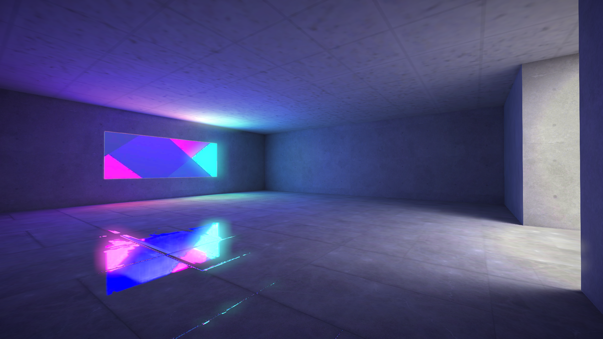

# three.js lightmap interior test

A simple three.js demo scene where a lightmap that was generated in Blender using the addon The Lightmapper is tested. Ground reflections were made possible through box-projecting an env-map. The env-map was also generated in Blender. The scene and the textures were compressed using gltfpack and basisu. All textures are in KTX2 format.
 
 
**View the [Online Demo](https://0beqz.github.io/lightmap_interior_test/)**

 Download size: 4.7 MB

 
 

## Screenshots

 
 

## Credits

Template:

* three.js GLTF scene template by [Gabriel Ramirez](https://github.com/GabrielRamirez/threejs-gltf-template)

Collision:
* Octree collision checking by [supereggbert](https://github.com/supereggbert)

Shaders:
* Box-projecting env-map shader code by [codercat](https://codercat.tk)

Meshes:
* Map mesh by [Naxela](https://github.com/Naxela)

Audio:
* Lamp hum audio by [kyles](https://freesound.org/people/kyles)
* Rainbow shades picture room synthony by [Lemoncreme](https://freesound.org/people/Lemoncreme)
* Purple shades picture room synthony by [ShadyDave](https://freesound.org/people/ShadyDave)

Images:
* Rainbow shades picture by [Steve Johnson](https://unsplash.com/@steve_j)
